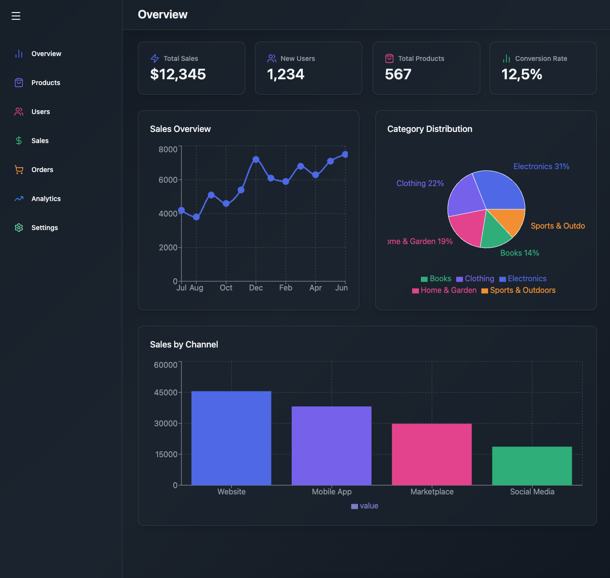
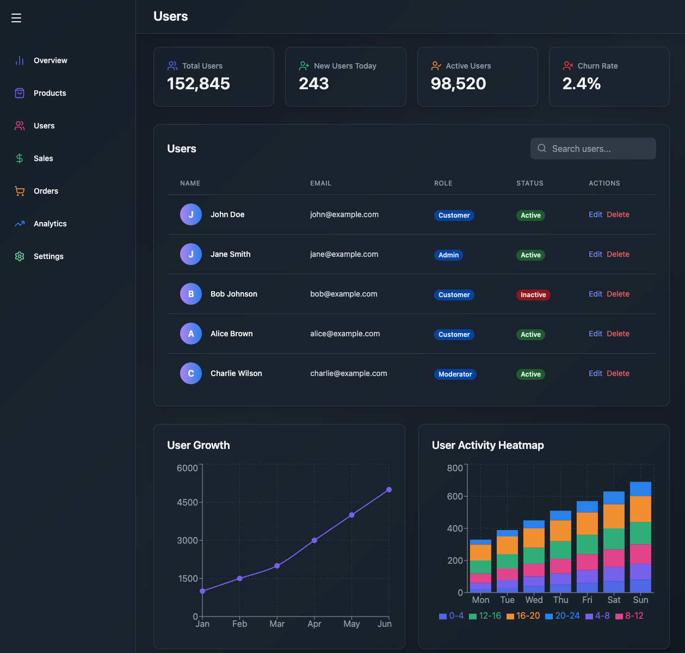
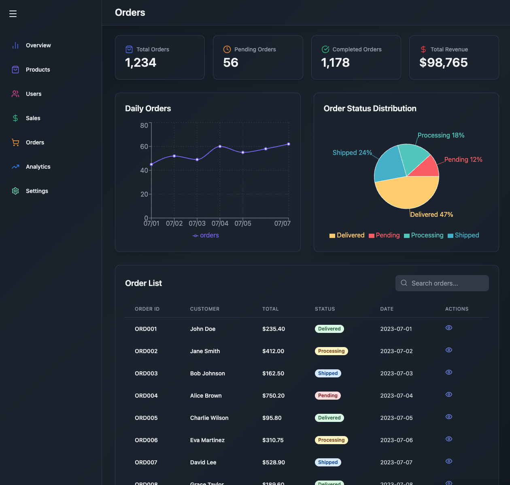
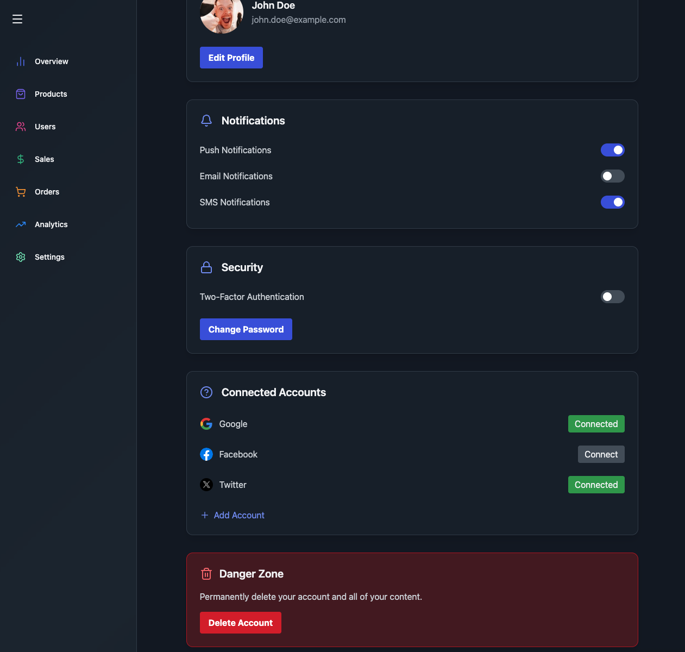

# 💬 Admin Dashboard 

       

An admin dashboard application featuring interactions and charts. Built entirely with React, TailwindCSS, DaisyUI, Vite, Framer Motion and Recharts for a beautiful UI, smooth animations and data visualization.
🌐 [Visit the app](https://admin-dashboard-gzorakes.onrender.com)

## 📸 Dashboard

  

## ✨ Features

- 🎨 Responsive UI styled with TailwindCSS + DaisyUI
- ⚡ Fast development environment with Vite
- 📊 Interactive charts and data visualization with Recharts
- 🌀 Smooth animations powered by Framer Motion

## 🛠️ Tech Stack

- React  
- TailwindCSS & DaisyUI  
- Vite  
- Framer Motion  
- Recharts 

## 🏗️ Development Highlights

- Modular architecture for clean, scalable code
- Reusable UI components with DaisyUI & TailwindCSS
- Animations (Framer Motion)
- Charts for stats/analytics (Recharts)
- All features run entirely in the browser

## 📸 Users

  

## 📸 Orders

  

## 📸 Settings

  

